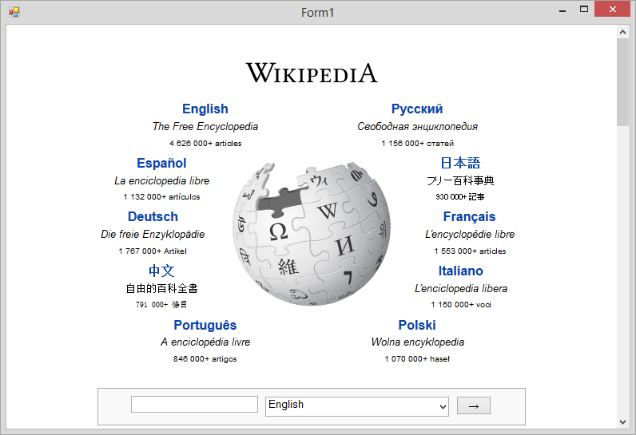
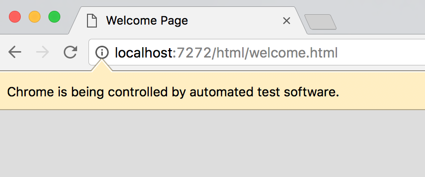

# Netlenium Framework 

Netlenium is a cross-platform Framework (or sub-framework)
written under .NET Framework 4.5.2. Netlenium contains
libraries to support Web Automation tasks on both
full Web Browsers and Core-Library based Browsers.

## NOTICE

This repo is no longer used! The code in this repo is
not finished and it is outdated, please refer to
`Netlenium` instead!!!

## Difference between Full & Core-Library Web Browsers

Core-Library Web Browsers are technologies which are
open source solutions that have been embedded into
Netlenium Framework. In most cases no extra software
or dependencies are needed to run a Core-Library Web
Browser and they are not WebDriver based but rather
uses direct calls to accomplish tasks.

-----------------------------------------------------

Full Web Browsers are simply Browsers that have to be
installed on the machine in order for Netlenium to use
them. Netlenium Framework contains assets to control
these web browsers but does not come with the web
browser itself. These web browsers are usually controlled
using a Web Driver which is automatically downloaded
from official sources and kept up to date.

-----------------------------------------------------

When writing code for Netlenium, you don't need to focus
on the dependencies that Netlenium Requires since they
are handled automatically when needed. But as explained
above, when using Full Web Browsers such as
"Google Chrome", the browser needs to be installed on
the system unlike Core-Library Web Browsers where all the
libraries are embedded into the Framework

# Mono Compatibility

At the moment Netlenium Framework can be built for
mono and it can run on Linux such as Debian with
`mono-devel` installed. But some Core-Library Web
Browsers lack support for GTK, so where those Browsers
may work without issues on Windows may have issues
running on Linux. Full Web Browsers such as Firefox or
Google Chrome which are available on Linux can be used
by Netlenium Framework without any complications.

Netlenium Framework can auto-detect the platform and run
the correct operations without any issues, but if needed
you have the choice to hard-code support for one platform
only.
